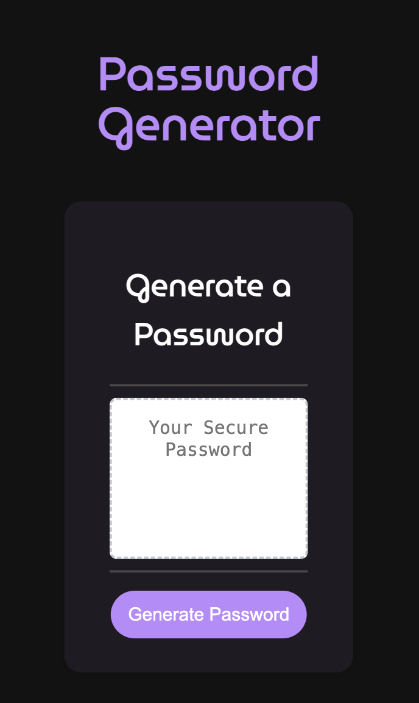

# Marco Franco • Password Generator

## Project Description
Generate strong and secure passwords effortlessly with my Password Generator! This user-friendly website ensures your online accounts stay protected by creating unique, randomized passwords tailored to your specifications.

You can select length (8-128 digits) and choosing whether to include lowercase letters, uppercase letters, numbers, and special characters. Simple, versatile, and ultra-secure!

## Mock-Up

The following image shows the web application's appearance on desktops' screen:

The following image shows the web application's appearance on tablets' screen:

The following image shows the web application's appearance on smartphones' screen:

## Credits
- [w3schools.com](https://www.w3schools.com/)
- [developer.mozilla.org/en-US/](https://developer.mozilla.org/en-US/)

## Repository and Webpage link

- [Repository Link](https://github.com/marphco/marco-franco-password-generator)
- [Deployed Application Link](https://marphco.github.io/marco-franco-password-generator/)